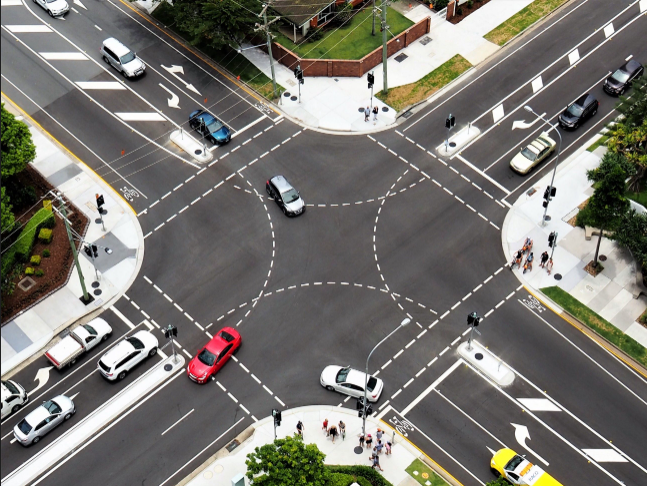
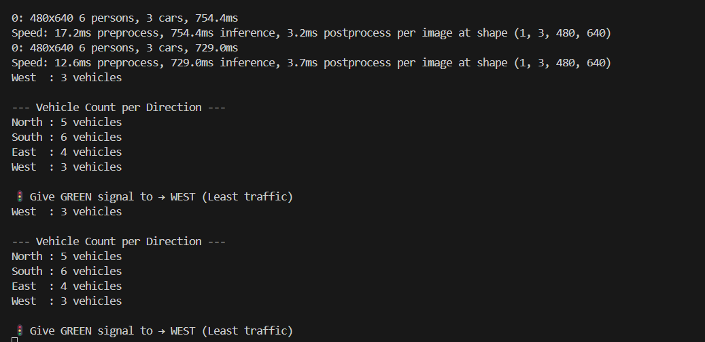
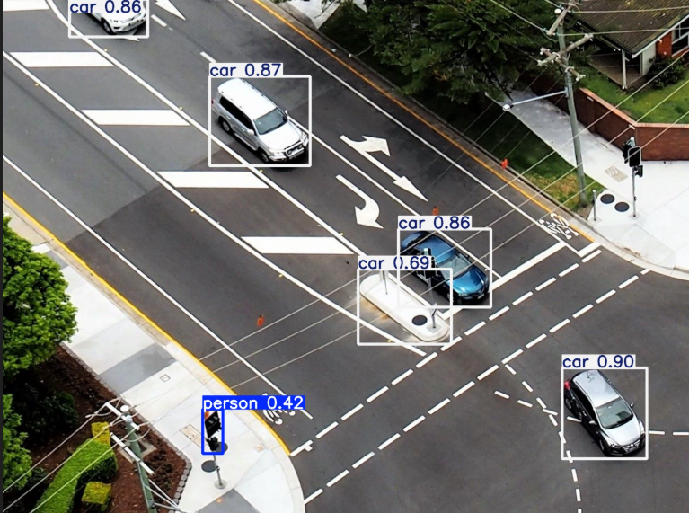
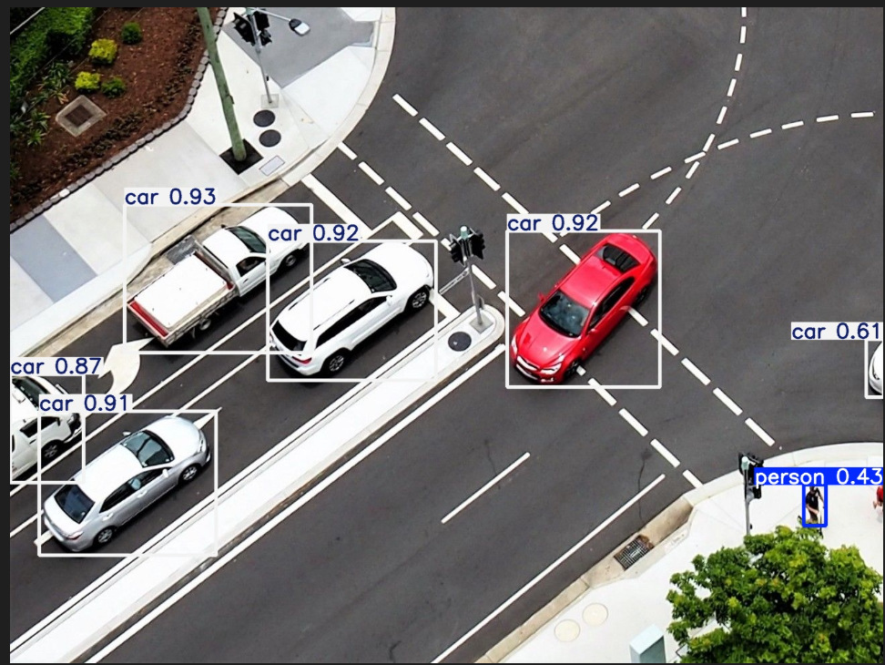
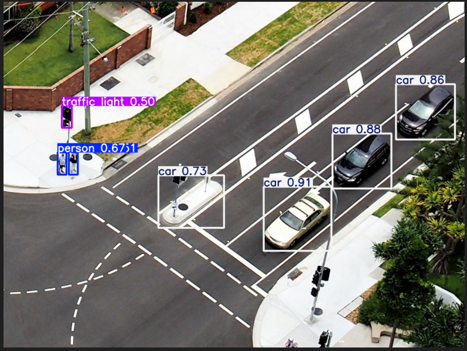
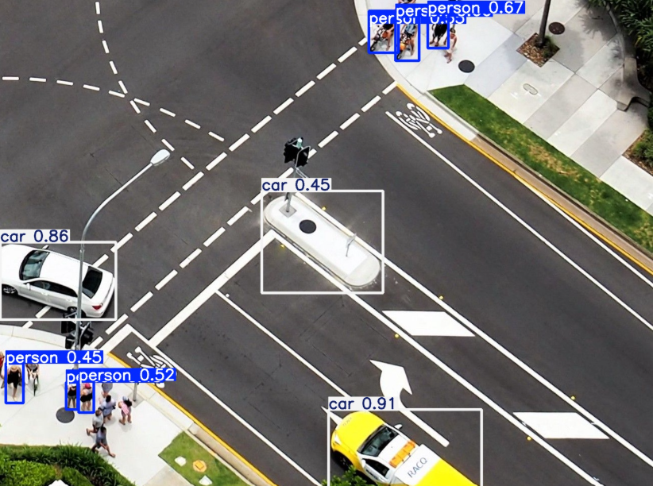
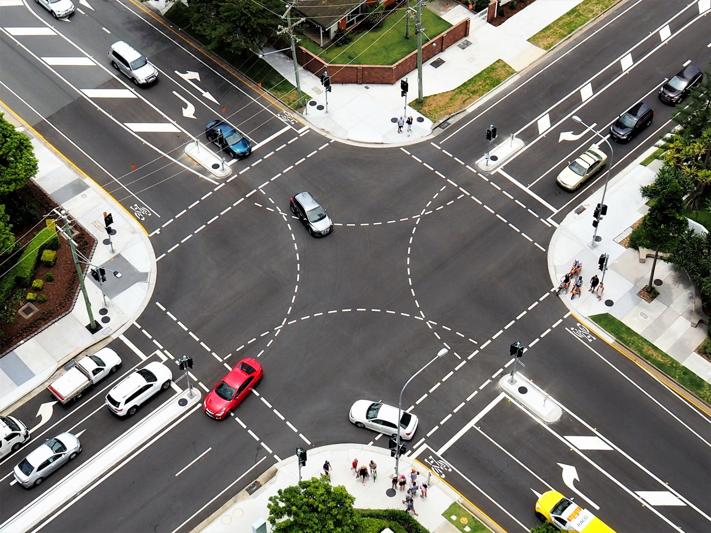

# 🚦 YOLO-Based Traffic Vehicle Detection System

---

## 🧠 Project Overview

This project is an **AI-based traffic monitoring system** that uses the **YOLO (You Only Look Once)** object detection model to detect and count vehicles in real-time traffic scenes. It also helps in analyzing traffic density from different directions (North, South, East, West) to assist in intelligent traffic signal control.

---

## 🎯 Objective

- Detect vehicles in real-time traffic images/videos  
- Count vehicles in each direction  
- Analyze traffic density  
- Support smart traffic signal decision-making  

---

## ⚙️ Features

### 🚗 Vehicle Detection
- Uses YOLO object detection model  
- Detects cars, bikes, trucks, etc.  

---

### 📊 Vehicle Counting
- Counts vehicles in each direction  
- Helps in traffic density estimation  

---

### 🚦 Traffic Signal Logic
- Suggests signal timing based on traffic load  
- Helps reduce congestion  

---

### 🖼️ Direction-wise Analysis
- North, South, East, West traffic outputs  
- Intersection-level traffic visualization  

---

## 🧰 Tech Stack

- Python  
- OpenCV  
- YOLO (You Only Look Once)  
- Computer Vision  
- NumPy  

---

## 🏗️ Project Files

YOLO Traffic System/
│
├── traffic_signal.py
├── vechicle_counter.py
├── input_image.png
├── traffic_output.png
├── north_output.png
├── south_output.png
├── east_output.png
├── west_output.png
├── intersection.jpg

---

## 🔄 Workflow

Input Image/Video → YOLO Model → Vehicle Detection →  
Direction Classification → Vehicle Counting → Traffic Analysis → Output Visualization

---

## 📸 Output Visualizations

### 🖼️ Input Image

---

### 🚦 Traffic Detection Output

---

### 📍 Direction-wise Analysis

#### North Direction

#### South Direction

#### East Direction

#### West Direction

---

### 🚧 Intersection View

---

## 🚀 How It Works

1. Input traffic image is provided  
2. YOLO model detects vehicles  
3. Bounding boxes are drawn around vehicles  
4. Vehicles are counted per direction  
5. Traffic density is analyzed  
6. Output images are generated  

---

## 🌍 Applications

- Smart traffic management systems  
- City traffic optimization  
- Autonomous vehicle systems  
- Road safety monitoring  
- Smart city infrastructure  

---

## 🔮 Future Enhancements

- Real-time video processing  
- Adaptive traffic signal control using AI  
- Integration with IoT traffic systems  
- Emergency vehicle priority detection  
- Cloud-based traffic monitoring dashboard  

---

## 🏆 Project Impact

This project demonstrates:

- Computer Vision (YOLO object detection)  
- Real-time traffic analysis  
- Smart city AI systems  
- Automation in transportation systems  

It is highly relevant for **AI/ML internships, hackathons, and research portfolios**.

---

## 👩‍💻 Author

**Charuhasini**  
AI & Data Science Student  

🔗 GitHub: https://github.com/Charuhasini30
